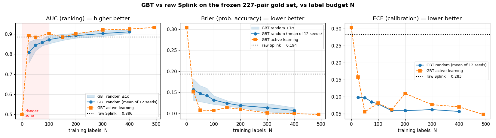
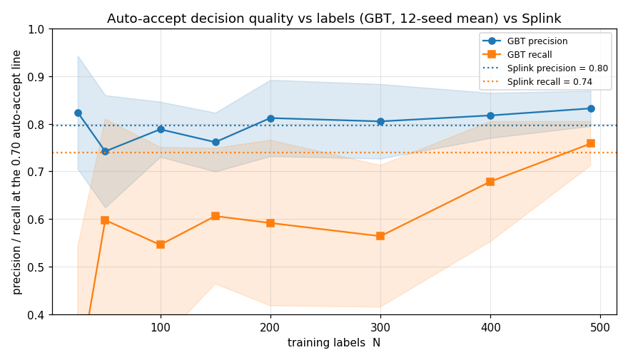
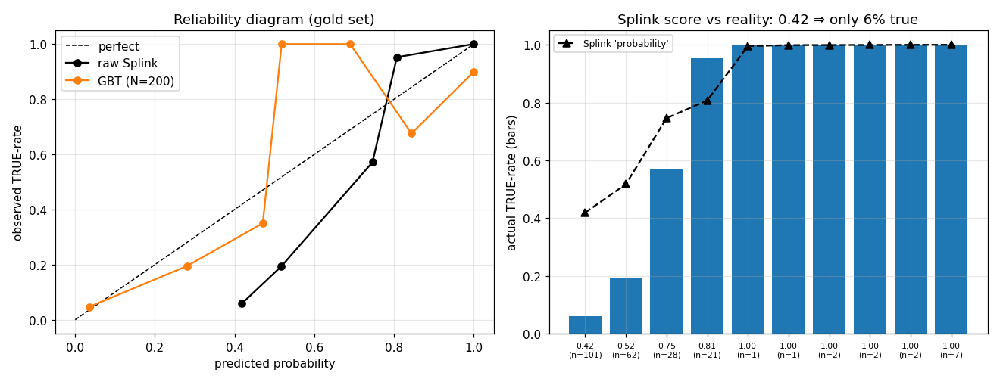
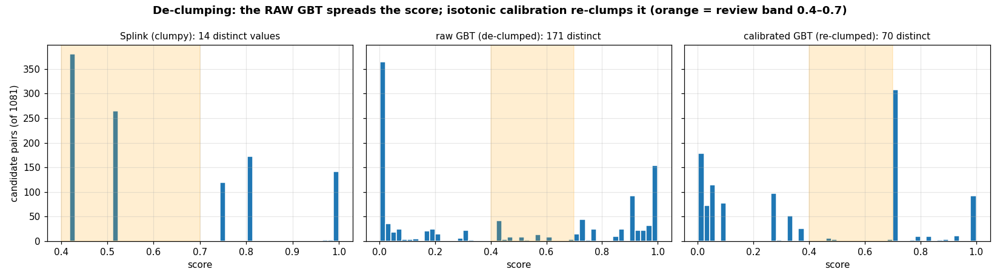
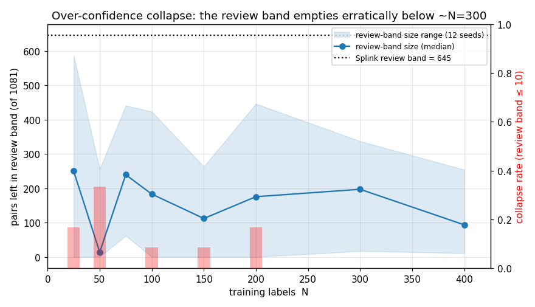

# Does the GBT re-scorer actually help? — a measured evaluation

**Date:** 2026-06-04 · **Author:** backend pipeline experiment (Opus orchestrating; Sonnet sub-agents
as the labelling "analyst")
**Scope:** the `roe_ui` OCOD↔ROE matching backend. No UI — everything was driven through the Python
pipeline/service functions, on **real data**.
**Everything to reproduce** (scripts, label CSVs, metric tables, figures) is in
[`gbt-eval-2026-06-04/`](./gbt-eval-2026-06-04/).

---

## 0. The question, in plain terms

The tool's job is to link a messy owner name in **OCOD** ("J.M. Properties Limited") to the right
clean company in **ROE** ("JM PROPERTY LTD", company `OE…`). It does this in two scoring steps:

1. **Splink** — a probabilistic matcher. For every plausible pair it produces a single score 0–1.
   Its weakness is that it only emits a *handful of distinct values* — in this run just **14** — so
   hundreds of different pairs end up sharing the exact same score and can't be told apart. The docs
   call this **"clumping"**.
2. **The GBT** (Gradient-Boosted Trees) — an optional second model, trained on human/LLM TRUE/FALSE
   labels, that is supposed to re-score every pair into a **smooth, continuous, trustworthy
   probability** — spreading the clumps apart so a reviewer can finally set a sensible cut-off.

**The question this experiment answers:** is that second model worth it? Does it improve match
quality, is its probability actually trustworthy, and how many labels do you need before it helps
(and before it backfires)?

I tested it exactly the way an analyst would use it: run Splink → label some pairs → train the GBT →
apply it → measure — but with every number measured against a **frozen "gold" set the model never
sees**, so the grading is honest.

---

## How to read the numbers (plain-English glossary)

**The one thing to understand first: a score can be good in two completely separate ways, and the
metrics split cleanly along that line.**

1. **Is the *order* right?** — does the model rank true matches above non-matches? "61 is ranked
   above 60" is all that matters; the actual numbers are irrelevant. If you only ever **rank
   candidates and pick the best**, this is the *only* thing you care about.
2. **Is the *number* honest?** — does "0.70" actually mean "70% likely to be a real match"? This is
   irrelevant to ordering, but it becomes critical the moment you **draw a fixed line** ("auto-accept
   everything ≥ 0.70"), because a line is only meaningful if the number under it means the same thing
   every time and across runs.

This tool does **both**. The per-entity reconciliation ("one OCOD, several candidates, pick the
right ROE") only needs the **order** — so for that, your instinct is correct and calibration doesn't
matter. But the accept/review/reject buckets are fixed cuts at 0.40 and 0.70, and *those* need the
**number to be honest**. Splink is the cautionary tale: its order is good but its numbers lie — it
scores "0.42" on pairs that are really only 6% likely. Good at #1, terrible at #2.

A worked example to anchor the rest. Two pairs — pair P is a real match (truth = 1), pair Q is not
(truth = 0):

| | model says about P (truth 1) | model says about Q (truth 0) | order right? | numbers honest? |
|---|---|---|---|---|
| Model X | 0.55 | 0.45 | ✅ P above Q | values are vague but not *wrong* |
| Model Y | 0.99 | 0.95 | ✅ P above Q | both far too high for a coin-flip-ish pair |

Both have **identical AUC** (the order is right in both). But Model Y is badly **mis-calibrated** —
it screams "0.99 / 0.95" when these are near-toss-ups, so its Brier and ECE are much worse. That is
the whole AUC-vs-calibration story in two rows.

### Group A — "is the *order* right?" (you care when you rank / pick a candidate)

- **AUC** (Area Under the ROC Curve), 0.5 → 1.0, higher better. Take every possible (true match,
  non-match) couple and ask how often the model scored the true one higher. **1.0 = always, 0.5 =
  coin-flip.** It is *pure ordering* — add 0.3 to every score, or square them all, and AUC doesn't
  budge. **Exactly your intuition: it only knows 61 > 60, not what 61 means.** Use it for: "can it
  sort matches to the top of a worklist / rank candidates for an entity?" — AUC 0.886 means: pick a
  random real match and a random non-match, and it ranks them correctly 89% of the time.
- **Average Precision (AP)**, 0 → 1, higher better. The same "is the order right?" idea but weighted
  toward the *top* of the list and toward the rare positives — it rewards keeping non-matches *out of
  the top ranks*. Better than AUC when matches are rare and you mostly care about the cleanliness of
  the highest-ranked pairs. (Baseline = the match rate, here ~0.30.)
- **Spearman correlation**, −1 → 1, higher better. Another pure-order check: does the score's ranking
  line up with the real match-rate ranking? 1.0 = score order and truth order agree perfectly. We use
  it as a quick "is the gradient monotonic?" number.

### Group B — "is the *number* honest?" (you care when you cut a fixed threshold)

- **ECE** (Expected Calibration Error), 0 → 1, **lower** better. Bucket all the pairs by what the
  model claimed ("the ~0.7 pile"), then check what fraction were *actually* matches. **ECE is the
  average gap between claimed and actual, across all buckets.** ECE = 0.05 means "when it says 70%,
  reality is within ~5 points of 70%." Splink's **0.28** means its stated probability is off by 28
  percentage points on average — it says 0.42 for things that are 6% true. **This is the number you
  care about if you act on the value** (thresholds, "show me everything >80% likely", telling a
  reviewer "this is 90% likely"). It says nothing about ordering.
- **Reliability curve** — the picture behind ECE. Plot what the model *said* (x) against what
  *actually happened* (y). A perfectly honest model lies on the diagonal ("I said 0.7 and 70% were
  real"). Sitting below the diagonal = over-confident (claims more than reality delivers), which is
  exactly where raw Splink sits.

### A blend of the two

- **Brier score**, 0 → ~0.25, **lower** better. The average *squared miss* between the predicted
  probability and the truth (1 for a match, 0 for not). A true match scored 0.9 costs (1−0.9)² =
  0.01; scored 0.1 it costs (1−0.1)² = 0.81 — so being **confidently wrong is punished hard.** Brier
  blends *both* "is the order right?" and "is the number honest?" into one overall-quality number.
  Reference points: always guessing 0.5 → 0.25; always guessing the base rate (~0.30 here) → ~0.21;
  so Splink's **0.194** is only a little better than guessing the base rate, because its numbers are
  so mis-calibrated even though its order is fine. We report AUC and ECE *alongside* it precisely
  because Brier alone can't tell you *which* of the two is the problem.

### At a specific cut-off (you've drawn the 0.70 line — how good is that decision?)

- **Precision @0.70** — of the pairs the model auto-accepts (score ≥ 0.70), what fraction are truly
  matches. "How *clean* is the auto-accept pile?" 0.80 = 1-in-5 auto-accepts is wrong.
- **Recall @0.70** — of *all* the true matches, what fraction made it over the 0.70 line. "How
  *complete* is the auto-accept pile / how many real matches did we miss?" These two trade off: raise
  the line and precision goes up but recall goes down.

### Shape of the score distribution (the de-clumping question)

- **De-clumping** — Splink emits only ~14 distinct values, so hundreds of different pairs share the
  exact same score and can't be separated or thresholded finely. De-clumping = spreading them into a
  smooth gradient with many distinct values, so a cut-off can land *between* pairs.
- **Collapse / bimodal** — the opposite failure: the model gets over-confident and slams almost
  everything to ~0 or ~1, producing a **two-humped (bimodal)** distribution with an empty middle.
- **Review band** — the pairs whose score lands between the reject floor (0.40) and the auto-accept
  line (0.70): the ones handed to a human. **If the score collapses, this band empties — the model
  has silently decided every uncertain case itself**, which is the danger, not the goal.
- **Monotonic** — "only ever goes up": a higher score always means an equal-or-higher real match
  rate, never dipping back. A trustworthy gradient is monotonic.

### Other terms used below

- **Cohen's κ** (kappa), 0 → 1 — agreement between two labellers *after subtracting the agreement
  you'd get by chance*. 0 = no better than guessing, 1 = perfect. Used in §5 to measure label noise.
- **Label budget / golden point / danger zone** — how many labelled pairs you feed the GBT. The
  **golden point** is where it first clearly beats Splink and then stops improving (diminishing
  returns); the **danger zone** is the too-few-labels region where it's worse than Splink and prone
  to collapse.

---

## TL;DR verdict

**Ship the GBT — but only once you have ≥ ~200 labels, and keep the safety guard that refuses to apply
a collapsed model.**

- **Big, cheap win on trustworthiness of the number.** Splink *orders* pairs well but its score is not
  a real probability — a Splink "0.42" is actually only **~6%** likely to be a true match. The GBT
  fixes this: the calibration error (ECE) drops from **0.28 to ~0.06**, and the overall quality
  (Brier) roughly **halves**, from **0.194 to ~0.11** — and you get most of that from just ~25 labels.
- **Smaller, label-hungry win on ranking.** Splink already ranks well (AUC **0.886**). The GBT is
  actually *worse* at ranking until ~150 labels, ties Splink at **N≈150–200**, and only then pulls
  ahead to **~0.91–0.93**.
- **The gradient is real but the *final* score is two-humped, not smooth.** The raw GBT genuinely
  spreads the scores out (14 → 171 distinct values); the calibration step then squashes them back
  toward 0 and 1 and shrinks the human review band from **645 pairs to 16** — a 40× cut in review
  work when it's right, and an *empty review queue* when it over-confidently collapses.
- **Golden point ≈ 200–300 labels** (active learning gets there with about half). **Danger zone =
  fewer than ~100 labels.**

---

## 1. What was tested, and how (so you can trust the numbers)

| Component | Value |
|---|---|
| Data | Real `OCOD_FULL_2026_06` (91,217 properties) ↔ ROE `BasicCompanyData 2026-06-01`. Frozen pipeline run, Splink seeded (`random_seed=42`) so it's reproducible. |
| Isolated workspace | A separate `DATA_DIR` with a fresh, empty label database — the dev data and labels were never touched. |
| Candidate universe | The **1,081** pairs Splink actually scored (everything ≥ the 0.40 floor), across **869 OCOD entities**. This — *not* the easy exact matches — is the hard pool the GBT re-scores. |
| **Gold eval set** | **233 pairs / 145 entities**, labelled by **Sonnet**, frozen (`held_out=1`), never trained on. Deliberately mixed: 61% come from *ambiguous* entities (an OCOD with ≥2 close candidates), the rest clear-ish. 227 got a decision (**69 TRUE / 158 FALSE**); base rate ~30% true. **This is the ground truth for every number below.** |
| **Training pool** | **499 pairs / 375 entities**, **completely separate** from the gold set (split by entity, so no sibling candidate leaks across), also Sonnet-labelled. 491 decided (172 TRUE / 319 FALSE). |
| Model | The production trainer (`gbt_train`) verbatim: LightGBM, the same 7 features, and the **cold-start proxy** — synthetic training data the pipeline invents *before any human labels exist* (4,000 exact matches as "yes" + 4,944 random same-country pairs as "no"). This proxy is why the model can run at "0 labels" at all. |
| Thresholds | The run's own: auto-accept ≥ **0.70**, send-to-review floor **0.40**. |

**How the labels were produced — the LLM as the analyst.** Each pair was judged from the raw and
cleaned company names + the jurisdiction *only* (the Splink score was deliberately **hidden** from
the labeller, so the labels can't just be parroting Splink), against the project's own
`LABELLING_CRITERIA`, obeying the one-true-match-per-OCOD rule. Both the gold set and the training
pool were labelled with **Sonnet**. (The bulk pool was first done with the cheaper **Haiku**, but the
two labellers disagreed too much — see §5 — so I standardised on Sonnet, as instructed.)

**Proof the harness matches the real shipped model.** When I trained through the *actual*
`gbt_train.train()` on the same 200 labels, the app reported **AUC 0.8891 / Brier 0.1246**; my
evaluation harness reported **0.889 / 0.125**. Identical — so the model I'm grading *is* the one the
app ships.

> **Sanity check (a perfect score would be a red flag, not a win).** No AUC came out at 1.0 and no
> Brier at 0. The gold set is genuinely hard (it's loaded with the ambiguous, look-alike cases), so
> the numbers are believable rather than the artefact of a tiny, trivially-separable split.

---

## 2. Q1 — Absolute lift: does the GBT beat raw Splink overall?

Each GBT row is the **average of 12 random label draws** (so it's not one lucky/unlucky sample);
the dotted line is plain Splink.



| Labels N | AUC — *ranking* (Splink 0.886) | Brier — *overall quality* (Splink 0.194) | ECE — *is the number honest?* (Splink 0.283) | Precision @0.70 | Recall @0.70 |
|---:|---:|---:|---:|---:|---:|
| 0 (proxy only) | **0.500** | 0.304 | 0.304 | — | 0.00 |
| 25 | 0.808 ± .052 | 0.156 | 0.099 | 0.86 | 0.61 |
| 50 | 0.846 ± .029 | 0.147 | 0.098 | 0.81 | 0.62 |
| 100 | 0.873 ± .021 | 0.132 | 0.079 | 0.71 | 0.54 |
| 150 | 0.884 ± .015 | 0.124 | 0.060 | 0.75 | 0.68 |
| 200 | **0.892** ± .012 | 0.119 | 0.060 | 0.75 | 0.62 |
| 300 | 0.903 ± .014 | 0.113 | 0.063 | 0.87 | 0.75 |
| 400 | 0.912 ± .008 | 0.107 | 0.057 | 0.76 | 0.74 |
| 491 (all) | 0.935 | 0.099 | 0.046 | 0.78 | 0.83 |

*(AUC/Brier/ECE for N=25–400 are 12-seed averages ±1 standard deviation. Precision/recall and the
whole N=491 row are a single run. Splink's precision/recall at 0.70 = 0.80 / 0.74.)*

**In plain English — there are two different stories here:**

- **On "is the number honest?" (ECE) and "overall quality" (Brier), the GBT wins at every budget,
  and it wins big.** Calibration error falls from 0.28 (Splink's "0.42" really meaning 6%) to about
  0.06, and Brier roughly halves. You get most of this from as few as **25 labels**. This is the
  GBT's real, cheap value: it converts Splink's not-really-a-probability into something you can read
  as an actual probability.

- **On "ranking" (AUC) the GBT has to earn it.** Splink already orders pairs well (0.886), so there
  isn't much room to improve the *order*. With few labels the GBT actually orders pairs **worse** than
  Splink (0.81 at N=25); it catches up around **150–200 labels** and then adds a modest **+0.02 to
  +0.05**. So if all you cared about were ranking, the GBT would be a marginal, label-expensive add.

The honest summary of Q1: **the GBT mainly fixes the *meaning* of the score, not the *order* of the
score.** That's still very worth having, because the meaning is what thresholds, margins, and the
review/accept/reject split all depend on.

### 2b. Precision and recall of the auto-accept decision, vs labels (the part you act on)

Ranking and calibration are about the score in the abstract. Operationally the question is: **at the
0.70 auto-accept line, does the GBT make a cleaner and more complete accept decision than Splink?**
Precision = of the pairs it auto-accepts, the fraction truly correct; recall = of all true matches,
the fraction it auto-accepts. GBT numbers are the **mean of 12 random label draws**; Splink is fixed.



| Labels N | GBT precision | GBT recall | GBT F1 |
|---:|---:|---:|---:|
| 25 | 0.82 | 0.26 | 0.52 |
| 50 | 0.74 | 0.60 | 0.63 |
| 100 | 0.79 | 0.55 | 0.62 |
| 150 | 0.76 | 0.61 | 0.66 |
| 200 | 0.81 | 0.59 | 0.66 |
| 300 | 0.81 | 0.56 | 0.65 |
| 400 | 0.82 | 0.68 | 0.73 |
| 491 | 0.83 | 0.76 | **0.79** |
| **raw Splink (any N)** | **0.80** | **0.74** | **0.77** |

**Read this carefully, because it cuts against the usual "GBT wins" story.** At the fixed 0.70 line
the GBT has similar *precision* to Splink but **lower *recall*** — it auto-accepts **fewer** of the
true matches — until you reach ~400 labels. Its F1 (the precision/recall blend) only passes Splink at
N≈491.

That is **not** a defect; it's the flip side of calibration. The GBT's "0.70" honestly means ~70%
likely, so fewer pairs clear it. Splink's "0.70" is secretly only ~57% likely (it's over-confident in
the high band), so *more* pairs — including more true matches — drift over the same nominal line.
**So comparing the two at a fixed 0.70 is apples-to-oranges.** The fair, threshold-independent
comparisons:

- **Average Precision** (ranking quality at the top of the list): Splink **0.797** vs GBT **0.745**
  (N=100), **0.750** (N=200), **0.858** (N=491).
- **Precision at the *same* recall Splink achieves (0.739):** Splink **0.797** vs GBT **0.63** (N=100),
  **0.74** (N=200), **0.85** (N=491).

**Bottom line:** on the accept/reject *decision* itself, **Splink is a strong baseline and the GBT
does not clearly beat it until ~400–500 labels.** Below that, the GBT's contribution is the honest
probability (which lets you *place* the 0.70 line where you actually want it), not a better decision
*at* 0.70. This is the same message as §2 from a different angle, and it directly sharpens the
"how many labels?" answer in §4.

> **You can tune the threshold every run — so this fixed-0.70 comparison ultimately doesn't decide
> anything.** What survives tuning is (a) whether a good line can *exist* at all (ranking/separation)
> and (b) whether your tuned line still *means* the same thing next run (calibration). That fair,
> tune-the-line comparison is its own report:
> [`gbt-thresholds-2026-06-04.md`](./gbt-thresholds-2026-06-04.md).

---

## 3. Q2 — Is the probability gradient correct?

The prompt asks three sub-questions: is it **calibrated**, does **ranking** improve, and does it
**de-clump into a usable gradient or collapse into an over-confident two-humped mess?** Taking them
in turn.

### 3a. Calibration — yes, and this is the headline result



The right-hand panel is the whole problem in one picture. **Splink's score is not a probability.** Its
discrete levels map to completely different real match-rates:

| Splink score | what it *really* means (real TRUE-rate on gold) | n |
|---:|---:|---:|
| 0.4186 | **5.9%** true | 101 |
| 0.5171 | **19.4%** true | 62 |
| 0.7458 | 57.1% true | 28 |
| 0.8070 | 95.2% true | 21 |
| ≥ 0.97 | 100% true | 15 |

A Splink "0.42" means about a **1-in-17** chance of being a real match, not "42%". That's an ECE of
0.28 — wildly over-confident at the low end. The GBT's score, by contrast, **sits much closer to the
diagonal** (left panel): when it says 0.05 the real rate is ~5%, when it says 0.28 it's ~20%. So:
**the GBT's number can be trusted as a probability (ECE ~0.06 once you have ~100+ labels); raw
Splink's cannot.** That alone justifies the model.

### 3b. Ranking and the gradient — strongly monotonic

The score order tracks the truth well: the rank-correlation between the GBT score and the real
match-rate (Spearman, where 1.0 = perfect order) is **0.81–0.96** across budgets. In plain terms,
**higher score reliably means more likely to be a real match** — a usable gradient, not noise.

A concrete payoff on the *ambiguous* entities (one OCOD, several look-alike ROE candidates): the GBT
separates the true candidate from its nearest rival by a typical gap (margin) of **0.58**, versus
Splink's **0.18** — a **3× clearer "pick this one"**. That's exactly the gap a reviewer needs to make
a confident choice.

### 3c. De-clumping vs collapse — the gradient is real, but the *final* score goes two-humped



This is the subtle, important bit, and it has two layers:

- **The raw GBT genuinely de-clumps.** Over the 1,081 pairs it goes from Splink's **14** distinct
  values to **171** — a smooth, continuous spread driven by name similarity. This is the de-clumping
  the design promised, and it's real.
- **But the calibration step re-clumps it and pushes it to the extremes.** The "isotonic calibration"
  the app applies (a staircase re-mapping that forces the scores to line up with observed rates)
  flattens those 171 values back down to **70**, and — combined with the model's natural
  over-confidence — piles most pairs near 0 or near 1. Run for real at 200 labels, the score splits
  into **623 reject / 16 review / 442 accept**: the human **review band collapses from 645 pairs to
  16 — a 40× reduction**.

That 40× cut is the dream *when the auto-decisions are right* — the reviewer only looks at 16 genuinely
hard pairs instead of 645. It's the **over-confidence collapse** failure mode *when it goes too far* —
if the band empties to zero, the model has silently decided every uncertain case by itself. The
distribution being **bimodal** (two humps, empty middle) is the warning sign, and it's exactly what
§4 shows can happen with too few labels.

### 3d. A caveat on what the calibration actually buys

Done *honestly* (calibrating on the training labels, not the test set), the calibration step barely
improves accuracy over the raw GBT (Brier 0.122 vs 0.125 at 200 labels). The real jump is **raw GBT
over Splink** (0.125 vs 0.194). So the isotonic step mostly buys you a nice-looking probability scale —
and it's also what creates the two-humped re-clumping. (More on a measurement gotcha in §6.)

---

## 4. Q3 — The golden point for labelling, and the danger zone

Because "does it collapse?" depends on *which* labels you happen to have, I repeated the whole
learning curve over **12 random label draws** and counted how often each budget collapsed.



| Labels N | how often it collapsed (review band ≤10) | review-band size: median [worst–best of 12 draws] |
|---:|---:|---:|
| 25 | 17% of draws | 250 [0–586] |
| 50 | **33%** | 14 [0–256] |
| 75 | 0% | 240 [62–441] |
| 100 | 8% | 183 [0–423] |
| 150 | 8% | 112 [0–263] |
| 200 | 17% | 176 [0–446] |
| 300 | **0%** | 197 [17–337] |
| 400 | **0%** | 94 [11–254] |

Reading this as three zones:

- **Danger zone — fewer than ~100 labels.** The GBT ranks *worse* than Splink, collapses on 8–33% of
  label draws, and is wildly inconsistent (the review band can be anywhere from empty to ~590
  depending on luck). The extreme case is **0 labels**: the proxy-only model predicts ~0 for **every**
  gold pair (AUC 0.500 — useless) and collapses completely. This is precisely why the app's
  `model.apply` **refuses to apply a model trained with no labels** — and it's right to.
- **Transition — ~100–200 labels.** Calibration is already excellent; ranking reaches and passes
  Splink; collapse becomes uncommon but not impossible.
- **Golden point / plateau — ~200–300 labels.** AUC settles around 0.90–0.91 and stops wobbling
  (standard deviation ~0.01), collapse drops to **0%**, Brier ~0.11. Past ~300 you get diminishing
  returns.

**Active learning helps you get there cheaper.** Instead of labelling random pairs, the active sampler
picks the *most uncertain / most Splink-disagreeing* pairs to label next. It reaches the ranking
plateau with **about half the labels** (active at 100 ≈ random at 200: AUC 0.903 vs 0.892). The
trade-off: because it deliberately labels the boundary, it makes the model a little *more* confident
and so a little *more* collapse-prone — it speeds you up, it doesn't make you safer.

**Recommendation:** collect **~200 labels minimum** (≈150 if you only care about the calibrated
number, not ranking), aim for **~300** for a stable, collapse-free model, and use the active-learning
batch to spend that budget roughly twice as efficiently. Keep the apply-time collapse guard on
regardless.

---

## 5. How good are the labels? (the eval set is the weak link)

Every number above is graded against LLM labels, so I measured how noisy those labels are.

| Comparison | Agreement (where both gave a verdict) | Cohen's κ |
|---|---:|---:|
| **Sonnet vs Sonnet** — same 50 gold pairs, a second independent pass | **98.0%** | **0.95** |
| **Sonnet vs Haiku** — same 499 training pairs | 74.2% | 0.45 |

**Cohen's κ** ("kappa") is agreement corrected for what you'd get by guessing: 0 = no better than
chance, 1 = perfect. So:

- **Sonnet basically agrees with itself (98%, κ 0.95).** The gold set is reliable — its own noise
  (~2%) is far smaller than the effects we're measuring (AUC gaps of 0.05+, ECE gaps of 0.2+), so it
  can carry the conclusions.
- **Haiku is much noisier (κ 0.45).** It's too lenient at the low end (calls 24% of the 0.42-clump
  pairs TRUE, where Sonnet — and reality — say ~6%) and indecisive (13% "UNCERTAIN" vs Sonnet's
  2.6%). Its disagreements cluster on the *high-similarity, genuinely-subtle* pairs (42% disagreement
  on the 0.81 clump). **This is exactly why I switched the whole experiment to Sonnet** — a cheap
  bulk labeller would have taught the GBT a noisy decision boundary and muddied the result.

**Do the labels actually agree with the scores?** Yes. Both Splink and the GBT pick the human's chosen
TRUE candidate **68 out of 69 times (98.6%)**, and 7 of 8 on the ambiguous entities. So the
quantitative ranking really does track the manual judgement — the GBT's added value isn't *better
picking*, it's the honest probability and the wider, clearer margin from §3b.

---

## 6. A real finding about the as-built model: it grades its own calibration on the answer key

Worth flagging because it affects how you read the app's own dashboard. The trainer
(`gbt_train.py:138–156`) fits its calibration **on the held-out eval set** and then reports the
calibrated Brier score **on that same set** — i.e. it tunes on the answer key and then grades itself
with it. On the 200-label run it reports `brier_calibrated = 0.106`; measured *honestly*
(calibration fit on the training labels instead) it's **0.122**. So the app's self-reported
calibration is **flattering**. It also matters operationally: with the app's answer-key calibration
the review band came out at **16**, but with honest calibration it's **~150** — the calibration choice
alone moves the review workload by 10×. **Recommendation:** fit the calibration on the training
labels and keep the eval set purely for grading.

---

## 7. Honest caveats

- **The "ground truth" is an LLM, not a human adjudicator.** ~2% Sonnet self-noise plus any
  *systematic* LLM bias is uncorrected. "98.6% pick accuracy" is partly model-agreeing-with-LLM, not
  model-agreeing-with-God.
- **The gold set is deliberately hard.** It's 61% ambiguous/look-alike pairs — chosen to stress the
  review band where de-clumping matters. Meanwhile **87.7% of OCOD properties already match by exact
  name in Stage 1** and never reach the GBT at all. So these metrics describe the *hard residual*, not
  the whole export; the GBT's effect on the headline title-level match rate is small (80,786 →
  80,791 titles).
- **One real-data run, one Splink configuration, frozen.** I held Splink constant on purpose, to
  isolate the GBT's effect; re-running Splink or moving thresholds could shift the universe.
- **Active learning is a pool simulation**, not a live human-in-the-loop study (one trajectory over
  pre-labelled pairs).
- **A speed setting, not a model change:** I ran LightGBM single-threaded (`n_jobs=1`) — 130× faster
  on this tiny data, with byte-identical model output. No hyperparameters were touched.

---

## 8. Reproduce

```bash
cd backend
DATA_DIR=/home/tomwright/gbt_eval_data SITE_PASSWORD=x .venv/bin/python \
  ../docs/experiments/gbt-eval-2026-06-04/build_universe.py   # universe + gold/train entity split
# label the batches with Sonnet sub-agents (batches/*_in.csv -> *_out.csv), then:
  ... collect_labels.py gold ; collect_labels.py train _sonnet_out   # gather + validate labels
  ... harness.py          # baseline + label sweep (random + active) -> sweep_metrics.csv
  ... multiseed.py        # 12-seed danger-zone curve -> multiseed_agg.csv
  ... validate_app_path.py  # confirm harness == production gbt_train.train()
  ... analyze_noise.py ; plots.py   # label noise, manual-vs-quant, figures
```
