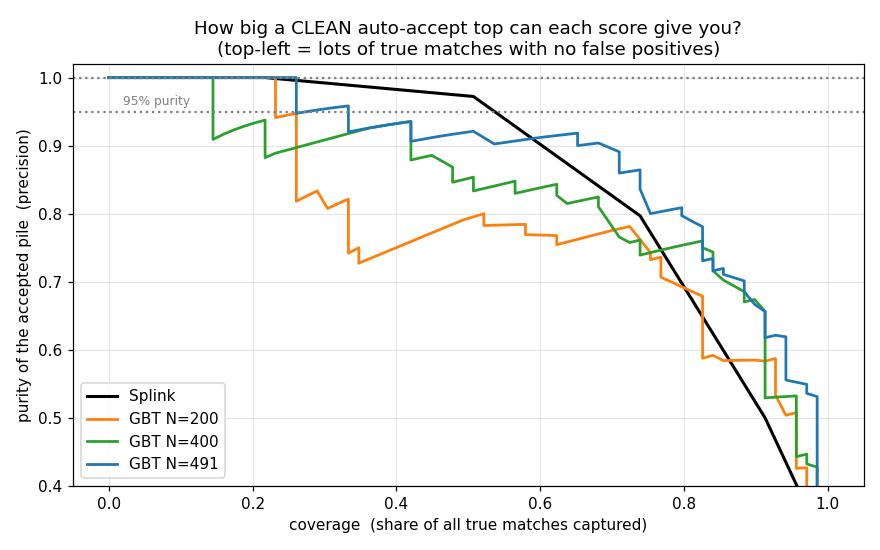
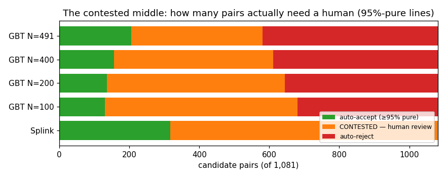
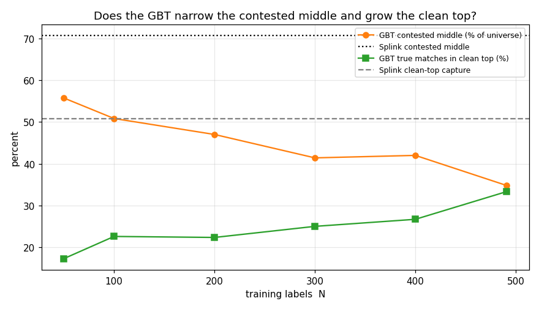

# Where do the two lines go? — auto-accept, auto-reject, and the contested middle

**Date:** 2026-06-04 · backend experiment, real OCOD↔ROE data, frozen Sonnet-labelled gold set.
**Companion to** [`gbt-eval-2026-06-04.md`](./gbt-eval-2026-06-04.md) (the overall "does the GBT help"
report). Same data, same harness; this one answers the *reviewer's* question, not the model's.
Reproduce: [`gbt-eval-2026-06-04/separation.py`](./gbt-eval-2026-06-04/separation.py).

---

## What this report is about (and why it's the right question)

A reviewer in this tool doesn't really care about an abstract accuracy number. They care about three
practical things, which between them *are* the whole job:

- An **auto-accept line** — a score high enough that you can accept everything above it **untouched**,
  trusting there are (almost) no wrong matches up there. You can always slide it *down* later to grab
  more; what you need to know is **how low you can put it before junk creeps in.**
- An **auto-reject line** — a score low enough that you can bin everything below it untouched,
  trusting there are (almost) no real matches down there.
- The **contested middle** between the two lines — the pairs where true and false matches are jumbled
  together, so a human *has* to look. **The width of that middle is your actual workload**, and a
  narrower one means the score is doing a better job of separating real from fake.

I call the cleanliness of an auto-decided pile its **purity** — "of the pairs I auto-accepted, what
fraction are genuinely correct" (and, for the reject pile, "what fraction are genuinely non-matches").
Purity is just precision, applied to both ends.

Everything below is measured on the frozen 227-pair gold set (so purity is *verified* against real
labels), and the resulting lines are then projected onto the full **1,081-pair candidate universe**
to count the real workload.

---

## The one idea that makes this simple

**Finding these lines, and the width of the contested middle, depends only on the *order* of the
scores — not on the actual numbers.** If you take any score and pass it through a calibration step
(which only ever stretches/squashes the dial without reordering anything), every pair stays on the
same side of every line. The accept pile, the reject pile, and the contested middle are **exactly the
same**.

So this whole report is really about **ranking** — the same thing AUC summarises — just expressed in
the operational form you actually use. Whether the dial *reads* honestly (so "0.85" means 85%) is a
**separate** question, handled in §6. Keep the two apart: **ranking decides where the lines can go;
calibration decides whether the number you write on the line means anything.**

---

## 1. The auto-accept line: Splink is already good — the GBT does **not** help here

"Is there a line above which (almost) everything is a true match?"

Read this as: as you drag the accept line **down** (moving right = accepting more matches), how *pure*
does the accepted pile stay (up = cleaner)? Top-left is the dream: lots of matches, no mistakes.

**Splink (black) is already strong here, and actually beats the GBT for most of the range.** Its
clumpy high end works *in its favour*: the 0.81 clump is ~95% true and the ≥0.97 clump is 100% true,
so Splink can auto-accept **~half of all true matches at ~97% purity** with no model at all. The GBT
curves sit *below* Splink across the middle — its continuously-spread top is actually a bit messier at
any given purity until you push to very high coverage.

The honest hard limit, **true for both**: if you demand a *perfectly* clean accept pile (zero wrong
matches), the line has to go so high that it only captures **~22% of all true matches**. Near the top,
some genuine look-alikes (a real match and a near-identical non-match) are simply tangled together, and
no amount of scoring untangles them — you'd have to review them. **Take-away: for setting the
auto-accept line, plain (calibrated) Splink is enough; the GBT buys you nothing here.**

---

## 2. The auto-reject line: this is the GBT's real gift — Splink **can't do it at all**

"Is there a line below which (almost) nothing is a true match?"

This is where it flips completely. **Splink cannot auto-reject anything.** Its lowest clump (0.4186)
is still **~6% true matches** — about 1 in 17. So there is no score, anywhere in Splink's range, below
which real matches are absent. Demand a reject pile that's ≥95% non-matches and Splink can reject
**zero** pairs. The reviewer is forced to eyeball the *entire* bottom of the pile by hand.

**The GBT fixes exactly this.** Its whole de-clumping job is to push the obvious rubbish — the pairs
that share a Splink clump with a few real matches — down toward 0, *away* from the genuine matches. So
the GBT opens up a clean reject zone where Splink had none: at the same 95% purity it can auto-reject
**~470–500** of the 1,081 pairs (more at lower purity bars). That is the single most valuable thing
the GBT does for a reviewer: **it clears the junk off the table.**

---

## 3. The contested middle: how many pairs a human actually has to touch

Put the two lines together and you get the picture that matters:

Green = auto-accept, **orange = the contested middle you must review**, red = auto-reject (95%-pure
lines, projected onto all 1,081 pairs). Splink (bottom) has a big green block but **no red at all**,
so its orange "must review" pile is enormous. Every GBT bar carves out a red auto-reject zone Splink
can't, and the orange middle shrinks as labels grow.

The numbers, by how clean you insist the auto-piles are (GBT = 400 labels, 12-seed mean):

| purity bar | Splink: accept / **review** / reject | GBT-400: accept / **review** / reject |
|---|---|---|
| 90% | 317 / **384** / 380 | 287 / **185** / 608 |
| 95% | 317 / **764** / 0 | 156 / **454** / 470 |
| 99% | 141 / **940** / 0 | 117 / **771** / 192 |
| 100% | 141 / **940** / 0 | 117 / **855** / 108 |

And how the review pile shrinks (and the reject pile grows) as you add labels, at the 95% bar:

| labels N | AUC | AP | auto-accept | **review (contested)** | auto-reject |
|---:|---:|---:|---:|---:|---:|
| Splink | 0.886 | 0.797 | 317 | **764** | 0 |
| 50 | 0.870 | 0.745 | 110 | 603 | 368 |
| 100 | 0.885 | 0.771 | 130 | 550 | 401 |
| 200 | 0.899 | 0.796 | 136 | 508 | 437 |
| 300 | 0.912 | 0.819 | 147 | 448 | 487 |
| 400 | 0.919 | 0.842 | 156 | 454 | 471 |
| 491 | 0.934 | 0.876 | 205 | **376** | 500 |

**Two things to take from this:**

1. **The GBT roughly halves the review pile, entirely via auto-reject.** At a 90% bar it cuts the
   contested middle from 384 → 185; at 95%, from 764 → ~450–376. The accept side barely moves (it
   even shrinks); 100% of the gain is "the GBT could throw away the obvious non-matches and Splink
   couldn't."
2. **The width of the contested middle is hugely sensitive to your purity bar.** Going from a 90%
   to a 95% cleanliness demand swings the GBT's review pile from ~185 to ~450 — because there's a
   band of genuine look-alikes sitting just under the accept line, and how many you tolerate is your
   call. **Choosing the purity bar *is* choosing the workload.**

---

## 4. So where do you actually set the lines? (concrete, on the final model)

Final model = GBT trained on all 491 Sonnet labels, **Platt-calibrated** (so the dial reads as a real
probability — see §6). Read these straight off the 0-to-1 score:

| purity bar | auto-ACCEPT (untouched) | **REVIEW by hand** | auto-REJECT (untouched) |
|---|---|---|---|
| **90%** | score ≥ **0.86** → 373 pairs | 0.72–0.86 → **82 pairs** | < 0.72 → 626 pairs |
| **95%** | score ≥ **0.93** → 205 pairs | 0.13–0.93 → **376 pairs** | < 0.13 → 500 pairs |

At a 90% purity target the reviewer is left with **82 pairs to check** out of 1,081 — the model
confidently handles the other ~1,000. Insisting on 95% balloons that to 376, because that pushes the
accept line up past the look-alike band. **On this data, ~90% is the sweet spot**: a big drop in work
for a small, recoverable amount of impurity (and you can hand-fix the few mistakes — that's what the
review queue is for).

---

## 5. Where this leaves AUC (your headline number)

You said AUC is the main thing — and that's right, because **AUC measures the ordering, and the
ordering is exactly what sets these lines.** A higher AUC = a cleaner separation = a wider auto-reject
zone and a narrower contested middle. That's the through-line of the table in §3: as AUC climbs from
Splink's 0.886 to the GBT's 0.92–0.93 (at 300–491 labels), the review pile falls from 764 to ~376.

Two refinements worth keeping in mind:

- **AP (Average Precision)** — the top-of-the-list version of AUC — explains why the *accept* side
  doesn't improve: Splink's AP is already 0.797, and the GBT doesn't clearly beat it until ~400
  labels. The accept top was never the problem.
- The auto-reject win doesn't show up loudly in either AUC or AP (they don't specifically reward a
  clean *bottom*), which is exactly why this report exists: **the bands are the operational face of
  the ranking that the summary numbers gloss over.**

So: **track AUC to judge the model; read the bands to set the lines.**

---

## 6. The separate axis: is the dial honest? (calibration)

Everything above is calibration-invariant — but to *place* a line at "0.86" and have it still mean
"~90% pure" next month, on next month's data, the dial has to be calibrated. This is the other half,
covered fully in the main report; the short version:

- **Raw Splink's dial lies** (its "0.42" is really 6% true), so a threshold you tune today is wrong
  next run. **Raw GBT and calibrated scores fix this** (calibration error drops from ~0.28 to ~0.05).
- **Calibrate with Platt/beta (a smooth curve), not isotonic (a staircase).** Isotonic ties scores
  together and re-clumps the dial — it can quietly empty your review queue and destroy the very
  separation this report relies on. Platt keeps the order intact and the dial smooth. (Full evidence
  in the main report §3/§6.)
- Because the *lines* are ranking-only, you could also just **calibrate Splink directly** for the
  auto-accept side and the honest dial — and only bring in the GBT for the auto-reject zone it uniquely
  unlocks.

---

## 7. Bottom line

- **For the auto-accept line: you don't need the GBT.** (Calibrated) Splink already gives a clean top
  — ~half the true matches at ~97% purity. The GBT doesn't beat it there.
- **For the auto-reject line: the GBT is essential.** Splink can reject *nothing* cleanly; the GBT
  clears ~half the pool off the table. That, plus the narrower contested middle, is its real
  operational value — and it grows with labels (clear by ~300–400).
- **The contested middle — your review workload — is set by two choices:** the model's ranking (AUC,
  improved by the GBT mainly on the reject side) and *your purity bar* (90% ≈ 82 pairs to review; 95%
  ≈ 376). Pick the bar deliberately; it's the biggest lever you have.
- **Recommended setup:** GBT on ~300–400 labels, Platt-calibrated, auto-accept ≥0.86 / auto-reject
  <0.72 at a 90% purity target — leaving ~80 pairs for the human, versus the 645–764 Splink would.

**Caveats** (shared with the main report): the gold labels are LLM-made (~2% self-noise); the gold set
is enriched for hard/ambiguous pairs so these are conservative; one frozen Splink run; the 95%/99%
purity lines are sensitive to a handful of gold labels given the set size, so treat the 90% column as
the robust one.
